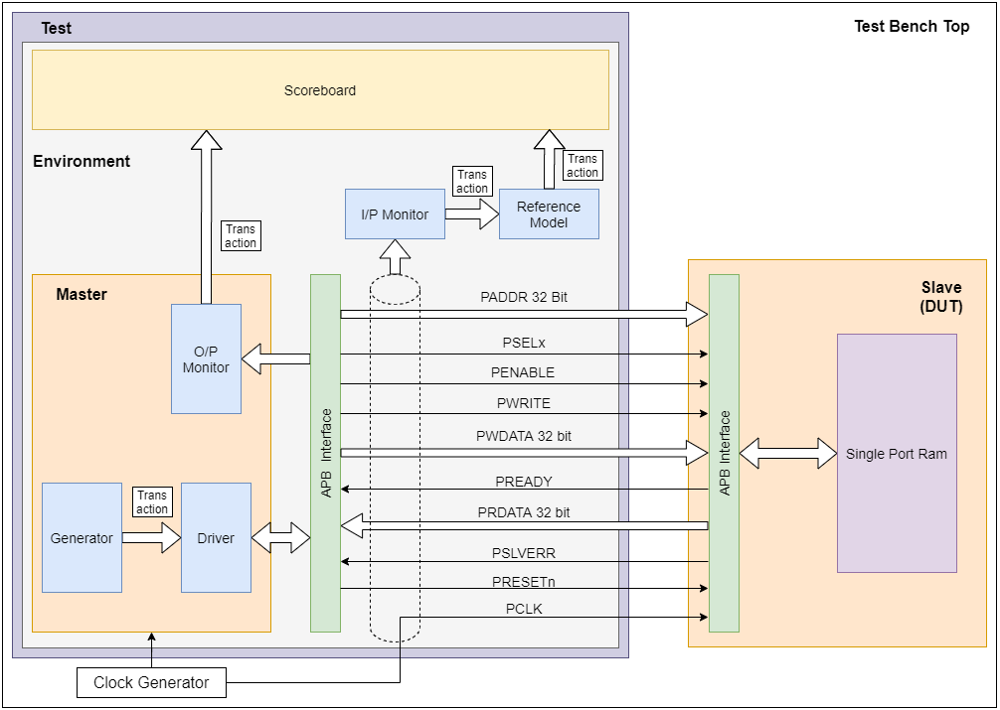
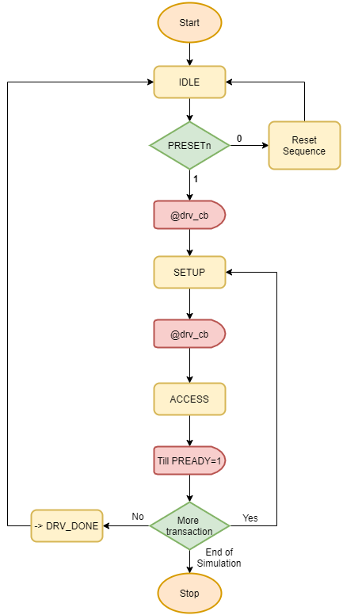

<style>
    figure {
      padding: 4px;
      margin: auto;
      text-align: center;
    }
    
    :nav {
        margin-left: 10px;
    }

    figcaption {
      color: rgba(0, 134, 125, 0.938);
      font-style: italic;
      padding: 2px;
      text-align: center;
    }

    table {
        margin-left: auto;
        margin-right: auto;
        width: auto;
    }
    th {
        border-bottom: 2px solid black;
        background-color: #4CAF50;
        color: white;
    }

    td {
        border: 1px solid black;
    }
</style>

<p class="nav"><a href="#sv-testbench">SV Testbench</a> | <a href="#uvm-testbench">UVM Testbench</a> </p>

## How to run test bench

- Download the latest release from below or visit the [release page](https://github.com/kumarrishav14/AMBA_APB/releases) for more releases.
    <table align="center">
        <thead>
        <tr>
            <th>SV Testbench</th>
            <th>UVM Testbench</th>
        </tr>
        </thead>
        <tbody>
        <tr align="center">
            <td>
                <a href =  "https://github.com/kumarrishav14/AMBA_APB/archive/v1.0.zip">Zip</a>
            </td>
            <td>
                <a href="https://github.com/kumarrishav14/AMBA_APB/archive/v1.0.zip">Zip</a>
            </td>
        </tr>
        <tr align="center">
            <td>
                <a href="https://github.com/kumarrishav14/AMBA_APB/archive/v1.0.tar.gz">Tar.gz</a>
            </td>
            <td>
                <a href="https://github.com/kumarrishav14/AMBA_APB/archive/v1.0.tar.gz">Tar.gz</a>
            </td>
        </tr>
        </tbody>
    </table>

<p>
    &NewLine;
</p>

- Copy the contents in a folder.
- Compile *tb_top.sv* in any simulator and simulate *top* module.

---

## SV Testbench

### Architecture

<figure>
    
    <figcaption><b>Fig. 1:</b> Testbench Architecture</figcaption>
</figure>

### Components

#### **Transaction**

Signals encapsulated in transaction class is shown below:

```sv
class transaction;
    // Input
    rand bit PWRITE;          
    rand bit[31:0] PWDATA [];   
    rand bit[31:0] PADDR [];   
    rand bit PRESETn;    
    bit PSEL1;
    bit PENABLE;

    // Output
    bit PREADY;
    bit [31:0] PRDATA [int];
    bit PSLVERR;
endclass
```

Transaction class also encapsulates helper function like `printf(string message)`, `compare(transaction trans)`, etc.

#### **Generator**

Generates new packet which is sent to the driver. Main functionality is to randomize transaction class.

```sv
task run();
    assert(trans.randomize());
endtask
```

#### **Driver**

Drives the packet according to the APB protocol. The drive seqeunce is as follows:

<figure>
    
    <figcaption> <b>Fig. 2: </b>Driver Flow</figcaption>
</figure>
<!--  -->

#### **Input Monitor**

Monitors the input signals of the APB protocol and when a complete transaction is monitored, it sends the sampled packet to reference model, which generates the expected value.

#### **Output Monitor**

Monitors the output signals of the APB protocol and after complete transaction is monitored it sends the packet to scoreboard for checking.

#### **Reference Model**

Generates the reference output/value, which is compared with the actual output received from the DUT

#### **Scoreboard**

Compares the actual packet and the reference packet and generates report for all the test cases.

---

## UVM Testbench

### Architecture


**_This project is governed by [MIT License](LICENSE)_**
